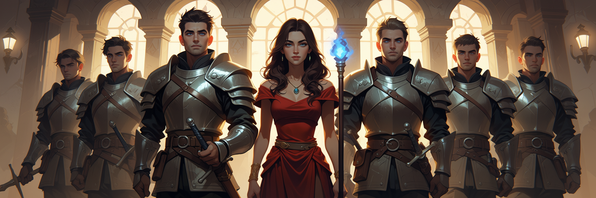

# TESS (Text Evaluation & Synthesis System)

**TESS** is a comprehensive local AI workspace built on top of [Ollama](https://ollama.com). It provides a powerful, unified interface for managing, testing, and interacting with your local large language models.


## Key Features

*   **Chat**: A robust chat interface with history, model selection, parameter tuning, and dynamic context injection.
*   **Long-Term Memory**: Persistent, tool-based memory system that allows models to remember user preferences, facts, and context across different conversations.
*   **Batch**: Run prompts across multiple models simultaneously to compare outputs.
*   **Personas & System Variables**: Manage custom system prompts (personas) and define custom system variables (e.g., loaded dynamically from local text files via `@file(path)`) for prompt templating.
*   **Python Workspace**: An interactive local Python IDE to write, execute, and stop code, run shell commands, and export scripts directly into custom AI tools.
*   **Story Studio**: High-fidelity, multi-speaker audio synthesis with voice cloning and dynamic character identification, using Omnivoice and Kokoro TTS.
*   **Voice Designer**: Craft custom synthetic voices by adjusting parameters like gender, age, pitch, and accent.
*   **Visual Generation & Photopea Editor**: Create stunning images using the Anima pipeline and edit them directly in the browser using an integrated Photopea workspace with layers support and save-back capabilities.
*   **Tools & Agents**: 
    *   **AI Tool Generator**: Build custom tools using natural language; the system generates the schema and logic for you.
    *   **Integrated Debugger**: Test and validate tools in a split-screen workspace before deployment.
*   **Web Search**: Equip your local models with real-time web access via integrated DuckDuckGo search and URL extraction.
*   **Apps Ecosystem**: A modular space for custom applications, including a dedicated **Notes** app with Google Drive synchronization and **Routineer** (a routine/habit tracker with calendar stats and interactive badges).
*   **Model Management**: Easily pull, delete, and manage your local Ollama models, and create new model variants (Modelfiles) directly within the UI.
*   **GPU & VRAM Monitoring**: Real-time VRAM usage and GPU activity monitoring in the header with one-click unload of all loaded models.

## Getting Started

### Prerequisites

1.  **Ollama**: Install and run [Ollama](https://ollama.com).
2.  **uv**: Install [uv](https://github.com/astral-sh/uv), the fast Python package installer and manager:
    *   **Windows (PowerShell)**:
        ```powershell
        powershell -c "irm https://astral.sh/uv/install.ps1 | iex"
        ```
    *   **macOS / Linux**:
        ```bash
        curl -LsSf https://astral.sh/uv/install.sh | sh
        ```
3.  **Local LLM**: Pull the default chat LLM in Ollama:
    ```bash
    ollama pull hf.co/unsloth/gemma-4-E4B-it-GGUF:Q4_K_M
    ```
4.  **Hardware (Recommended)**: An NVIDIA GPU with CUDA-compatible drivers (with at least 8GB VRAM required for running the Anima image generation model) is highly recommended for visual generation and voice synthesis (Kokoro/OmniVoice).

### Installation & Launch

1.  Clone the repository and enter the directory:
    ```bash
    git clone https://github.com/aole/TESS.git
    cd TESS
    ```
2.  Run the application:
    *   **Windows**: Run `run.bat` (which updates via git, syncs dependencies, and starts the server):
        ```powershell
        .\run.bat
        ```
    *   **macOS / Linux**: Run the main script with `uv`:
        ```bash
        uv run main.py
        ```
3.  Open your browser to `http://localhost:8080`.

### Google Drive Notes Sync (Optional)

To enable Google Drive synchronization for the Notes app:
1.  Go to the [Google Cloud Console](https://console.cloud.google.com/).
2.  Create a project and enable the **Google Drive API**.
3.  Configure the OAuth Consent Screen and create credentials for an **OAuth 2.0 Client ID** (select *Desktop app* as the application type).
4.  Download the JSON client secret, rename it to `client_secret.json`, and place it in the root of the `TESS` folder (see `client_secret.json.example` for reference).

## Technology

Built with ❤️ using:
*   [NiceGUI](https://nicegui.io) - For the beautiful, responsive web interface.
*   [Ollama](https://ollama.com) - For local LLM inference.
*   [uv](https://github.com/astral-sh/uv) - Fast Python package and project management.
*   [Omnivoice](https://github.com/k2-fsa/OmniVoice) & [Kokoro](https://github.com/hexgrad/kokoro) - For state-of-the-art TTS and voice cloning.

