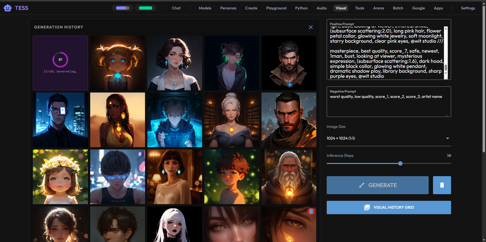
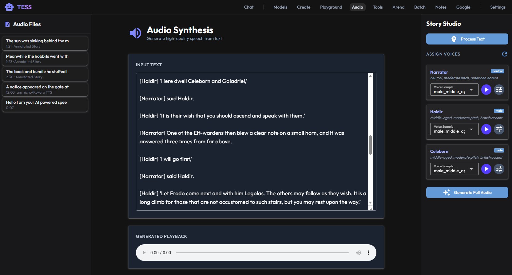
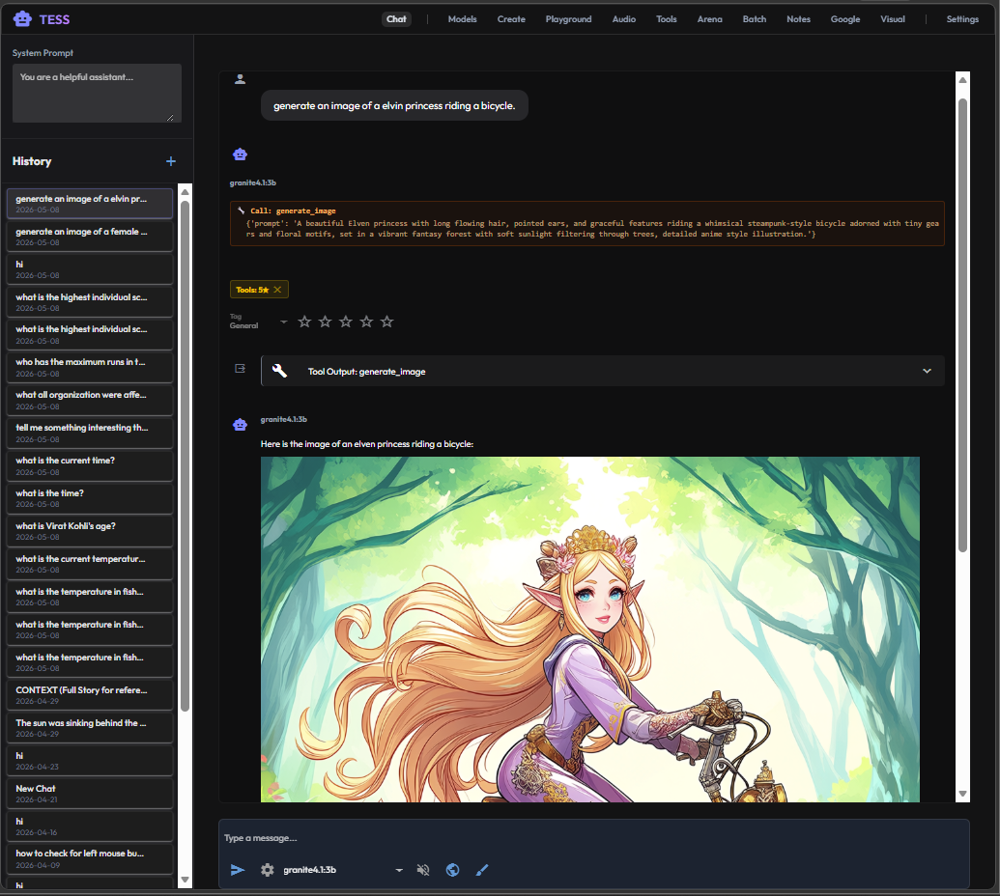

# TESS (Text Evaluation & Synthesis System)

**TESS** is a comprehensive local AI workspace built on top of [Ollama](https://ollama.com). It provides a powerful, unified interface for managing, testing, and interacting with your local large language models.





## Key Features

*   **Chat**: A robust chat interface with history, model selection, parameter tuning, and dynamic context injection.
*   **Long-Term Memory**: Persistent, tool-based memory system that allows models to remember user preferences, facts, and context across different conversations.
*   **Arena**: Compare models side-by-side to evaluate performance and reasoning.
*   **Batch**: Run prompts across multiple models simultaneously to compare outputs.
*   **Story Studio**: High-fidelity, multi-speaker audio synthesis with voice cloning and dynamic character identification, using Omnivoice and Kokoro TTS.
*   **Voice Designer**: Craft custom synthetic voices by adjusting parameters like gender, age, pitch, and accent.
*   **Visual Generation**: Create stunning images using the Anima pipeline. Includes progress indicators, history management, and integrated chat tool support.
*   **Tools & Agents**: 
    *   **AI Tool Generator**: Build custom tools using natural language; the system generates the schema and logic for you.
    *   **Integrated Debugger**: Test and validate tools in a split-screen workspace before deployment.
*   **Web Search**: Equip your local models with real-time web access via integrated DuckDuckGo search and URL extraction.
*   **Google Integration**: Connect your Google Workspace to analyze and synthesize documents.
*   **Apps Ecosystem**: A modular space for custom applications, including a dedicated **Notes** app with Google Drive synchronization.
*   **Model Management**: Easily pull, delete, and manage your local Ollama models.
*   **Custom Models**: Create new model variants (Modelfiles) directly within the UI.
*   **Playground**: An experimental space for rapid model testing and iteration.

## Getting Started

1.  Ensure [Ollama](https://ollama.com) is installed and running.
2.  Clone the repository:
    ```bash
    git clone https://github.com/aole/TESS.git
    cd TESS
    ```
3.  Run the application using [uv](https://github.com/astral-sh/uv) (which will automatically handle dependencies from `pyproject.toml`):
    ```powershell
    uv run main.py
    ```
4.  Open your browser to `http://localhost:8080`.

## Technology

Built with ❤️ using:
*   [NiceGUI](https://nicegui.io) - For the beautiful, responsive web interface.
*   [Ollama](https://ollama.com) - For local LLM inference.
*   [uv](https://github.com/astral-sh/uv) - Fast Python package and project management.
*   [Omnivoice](https://github.com/k2-fsa/OmniVoice) & [Kokoro](https://github.com/hexgrad/kokoro) - For state-of-the-art TTS and voice cloning.

